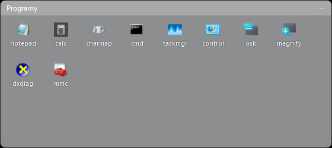
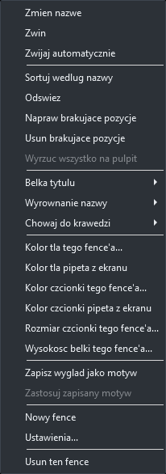
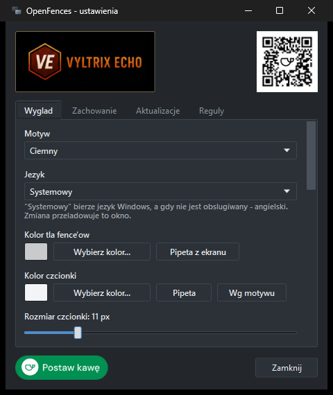

# OpenFences

Darmowy odpowiednik [Stardock Fences](https://www.stardock.com/products/fences/) na Windows 11.
Porzadkuje pulpit w polprzezroczyste kontenery ("fence'y") z wlasna siatka ikon.

C# + WPF, .NET 10. Bez zewnetrznych zaleznosci.

## Jak to wyglada

Fence z zawartoscia - polprzezroczysty kontener z wlasna siatka ikon:



Menu fence'a i okno ustawien:

| | |
|---|---|
|  |  |

## Co potrafi

**Fence'y**
- Tworzenie, usuwanie, zmiana nazwy (dwuklik w belke albo menu)
- Przeciaganie za belke tytulu, zmiana rozmiaru za kazda krawedz i rog. Zwezanie zatrzymuje sie
  dokladnie tam, gdzie obok belki miesci sie jeszcze cala kolumna (albo rzad) ikon - czyli
  "na rozmiarze ikon". Zeby zejsc nizej, jest zwijanie: dwuklik w belke zostawia sama belke
- **Wyrownanie nazwy na belce** - z lewej, na srodku albo z prawej. Przy belce pionowej
  dziala wzdluz niej: nazwa czyta sie z dolu do gory, wiec "z lewej" to dol belki.
  Domyslne w Ustawieniach -> Wyglad, osobno dla fence'a w jego menu ("Wyrownanie nazwy")
- **Belka tytulu z kazdej strony** - u gory, na dole, z lewej albo z prawej.
  Belka pionowa ma nazwe obrocona o 90 stopni (czyta sie z dolu do gory), a fence
  zwija sie wtedy w bok zamiast w gore. Domyslna strona jest w Ustawieniach ->
  Wyglad, pojedynczy fence ustawia sie w jego menu ("Belka tytulu")
- **Zwijanie** - dwuklik w belke zwija fence do samego paska tytulu
- **Automatyczne zwijanie** - fence zwija sie do belki sam, gdy kursor z niego zjedzie,
  i rozwija po najechaniu (menu fence'a: "Zwijaj automatycznie")
- **Chowanie do krawedzi** - fence przykleja sie do lewej / prawej / gornej / dolnej krawedzi
  i zwija sie do cienkiego paska. Najechanie mysza wysuwa go z powrotem
- Fence w trybie **portalu** - pokazuje na zywo zawartosc wskazanego folderu
  (zasobnik -> "Nowy fence z folderu...")
- **Motyw belki** - menu fence'a: "Zapisz wyglad jako motyw" zapamietuje kolor tla, kolor
  i rozmiar czcionki, rozmiar ikon oraz wysokosc i strone belki. Kazdy nowy fence dostaje
  ten wyglad od razu, a istniejacy bierze go z "Zastosuj zapisany motyw"

**Skroty i bezpieczenstwo ukladu**
- **Dwuklik w pusty pulpit** chowa i pokazuje wszystkie fence'y naraz. Dziala tylko na golym
  pulpicie - dwuklik w ikone albo w sam fence nic nie zmienia. Do wylaczenia w Ustawieniach
  -> Zachowanie
- **Uklad przezywa awarie**: kazdy zapis zostawia poprzednia wersje jako `layout.json.bak`,
  a nieczytelnego pliku glownego nie zastepuje uklad domyslny, tylko ta kopia

**Zawartosc**
- Przeciaganie plikow z Eksploratora prosto na fence - to, co przyjdzie z pulpitu,
  **znika z pulpitu** (patrz "Jedna ikona, nie dwie")
- Przenoszenie ikon miedzy fence'ami przeciagnieciem
- Ikony z powloki Windows w wysokiej rozdzielczosci (jumbo 256 px), z cache
- Menu pozycji: otworz, pokaz w Eksploratorze, wlasciwosci, wlasna nazwa, usun z fence'a
- Brakujace pliki zostaja wyszarzone zamiast zniknac po cichu
- Pasek przewijania nie zabiera miejsca - lezy na zawartosci i pojawia sie dopiero
  przy najechaniu na fence. Kolko myszy dziala zawsze

**Menu pulpitu**
- Prawy przycisk na pustym pulpicie: "Nowy fence tutaj" (powstaje dokladnie pod kursorem)
  i "Konfiguruj OpenFences"
- Wpisy siedza w HKCU, bez uprawnien administratora; wlacza i wylacza je checkbox
  w Ustawieniach -> Zachowanie
- Klikniecie trafia do *dzialajacej* instancji przez nazwany potok, wiec nie odpala
  drugiej kopii aplikacji

**Aktualizacje**
- Wbudowany updater: sprawdza kanal, pobiera nowy .exe, weryfikuje sume SHA-256,
  podmienia plik i restartuje aplikacje
- Kanal to zwykly JSON pod adresem HTTPS, ktory sam ustawiasz - GitHub Releases,
  wlasny serwer, cokolwiek
- Parametr `--update` robi caly przebieg bez okien (pod harmonogram zadan),
  a wynik ladzie w `%APPDATA%\OpenFences\update.log`

**Jezyk**
- Polski i angielski, domyslnie za jezykiem Windows (Ustawienia -> Wyglad -> Jezyk)
- Polski jest jezykiem neutralnym zestawu, angielski jedynym satelita - przy publikacji
  do jednego pliku satelita wchodzi do paczki, wiec nie ma czego gubic przy kopiowaniu .exe

**Wyglad**
- Motyw ciemny / jasny
- Kolor tla, **kolor czcionki**, **rozmiar czcionki** i **wysokosc belki tytulu** -
  globalnie oraz osobno dla kazdego fence'a
- **Pipeta** - pobranie koloru z dowolnego piksela ekranu, z lupa i podgladem HEX
- Regulowane krycie tla, zaokraglenie rogow, rozmiar ikon
- Opcjonalne ukrycie natywnych ikon pulpitu

**Auto-sortowanie**
- Reguly na fence: rozszerzenie, kategoria (dokument / obraz / wideo / audio / archiwum /
  program / skrot / folder), fragment nazwy, wyrazenie regularne, "wszystko inne"
- Nowe pliki na pulpicie trafiaja do pasujacego fence'a automatycznie
- Przycisk jednorazowego importu tego, co juz lezy na pulpicie

## Wymagania

- Windows 10 / 11
- [.NET 10 Desktop Runtime](https://dotnet.microsoft.com/download/dotnet/10.0) - do uruchomienia
- [.NET 10 SDK](https://dotnet.microsoft.com/download/dotnet/10.0) - do kompilacji

## Ikona

Ikona nie jest plikiem binarnym rzuconym do repozytorium - generuje ja skrypt,
wiec da sie ja odtworzyc i zmienic w jednym miejscu:

```powershell
.\tools\make-icon.ps1
```

Koncept "Kafle": dwa zachodzace na siebie zaokraglone panele, tylny polprzezroczysty,
gradient grafitowy `#9FB3C6 -> #33424F`. Skrypt zapisuje
`src\OpenFences\Assets\OpenFences.ico` z osmioma rozmiarami
(256, 64, 48, 40, 32, 24, 20, 16 px). Kazdy rozmiar rysowany jest w czterokrotnym
powiekszeniu i dopiero potem zmniejszany dwuszescienne - rysowanie wprost w 16 px
daje poszarpane krawedzie.

Ta sama ikona trafia w cztery miejsca:

| Gdzie | Skad |
|---|---|
| Ikona pliku `.exe` | `<ApplicationIcon>` w csproj |
| Zasobnik systemowy | osadzona w zestawie, ladowana w rozmiarze `SmallIconSize` |
| Instalator | `SetupIconFile` w skrypcie Inno Setup |
| Wpisy w menu pulpitu | `Icon` wskazuje na `OpenFences.exe,0` |

## Banner w ustawieniach

Okno ustawien ma trzy odnosniki: banner Vyltrix Echo nad zakladkami, prowadzacy na
`https://vyltrixecho.pl`, kod QR po prawej stronie tego samego paska oraz przycisk
"Postaw kawe" w stopce - oba na `https://buycoffee.to/vyltrixecho`.

Kod QR (`src\OpenFences\Assets\BuyCoffeeQr.png`) to 33 moduly plus otulina, czyli 41 modulow
na bok. Rysowany jest w 88 px, co daje niewiele ponad 2 px na modul - to dolna granica
czytelnosci dla aparatu telefonu, wiec nie zmniejszac go dalej. Tlo pod nim musi zostac biale;
ciemna otulina psuje odczyt, dlatego kafelek ma wlasne biale tlo zamiast grafitowego.

Przycisk kawy to oficjalna grafika buycoffee.to
(`https://buycoffee.to/static/img/share/share-button-primary--pl.png`, 351 x 92) wgrana
do `src\OpenFences\Assets\BuyCoffee.png`. Lezy w zasobach, a nie jest ciagnieta z sieci -
okno ustawien ma wygladac tak samo bez internetu i nie odpytywac obcego serwera przy
kazdym otwarciu. Zeby ja odswiezyc, wystarczy nadpisac ten plik nowa wersja spod tego adresu.

Banner Vyltrix Echo jest kadrowany skryptem, zeby kadr dalo sie powtorzyc po podmianie
materialu zrodlowego:

```powershell
.\tools\make-banner.ps1 -Source 'D:\brand\reklama.png'
```

Material zrodlowy nie lezy w repozytorium - sciezke podaje sie przy wywolaniu albo raz
ustawia w zmiennej srodowiskowej `VYLTRIX_BANNER_SOURCE`.

Skrypt wycina `src\OpenFences\Assets\VyltrixEcho.png` (318 x 116) z reklamy
1024 x 807 - lockup jest w niej okolo poltora raza wiekszy niz w osobnym pliku
logo 384 x 256, wiec napis ma realne piksele zamiast powiekszonej papki.

Granice kadru sa wpisane na sztywno, bo zostaly zmierzone profilem jasnosci.
Automatyczne progowanie sie tu nie sprawdza: dolna krawedz heksagonu schodzi
gradientem w ciemna czerwien i wypada ponizej progu, przez co kadr scinal
sześciokatowi spod. Po zmianie zrodla granice mierzy sie od nowa:

```powershell
.\tools\make-banner.ps1 -Source 'D:\brand\nowa-grafika.png' -Measure
```

## Belka tytulu z boku

Uklad fence'a to `DockPanel`, a nie siatka z wierszami - przestawienie belki na inna
strone jest wtedy jedna wlasciwoscia zamiast przekladania wierszy, kolumn i rozpietosci.

Dwie rzeczy, ktore trzeba bylo przy tym rozwiazac:

- **Kotwica przy zwijaniu.** Okno WPF zmienia rozmiar od lewego gornego rogu, wiec fence
  z belka na dole albo po prawej uciekalby razem z krawedzia. Na czas zwijania okno pilnuje
  krawedzi, przy ktorej stoi belka (`PinRollAnchor`), i zdejmuje kotwice dopiero po ostatnim
  ukladzie - inaczej wchodzilaby w droge zmianie rozmiaru.
- **Obrocona nazwa.** Tytul dostaje `LayoutTransform` o 270 stopni, ale margines i przycinanie
  licza sie dalej w ukladzie rodzica, wiec dlugosc tekstu trzeba ograniczac wysokoscia belki
  (`UpdateVerticalTitleLength`). Bez tego dluga nazwa wyjezdzalaby poza fence.

Zwija sie zawsze ta os, wzdluz ktorej stoi belka - dlatego model trzyma osobno
`RestoreHeight` i `RestoreWidth`.

## Uklad, kopia zapasowa i awarie

Zapis idzie przez plik tymczasowy i `File.Replace`, ktory jedna operacja systemu plikow
podmienia `layout.json` i odklada poprzednia wersje do `layout.json.bak`. Nie ma wiec chwili,
w ktorej zaden z plikow nie bylby kompletny.

Przy starcie nieczytelny `layout.json` jest odtwarzany z `.bak`, a jego kopia zostaje obok
jako `layout.json.broken-<data>` razem z opisem bledu. Trzy rzeczy, ktore latwo tu przeoczyc:

- **Uszkodzony plik to nie pierwsze uruchomienie.** `IsFirstRun` zostaje wtedy `false` -
  inaczej aplikacja wciagnelaby caly pulpit do swiezych, domyslnych fence'ow, czyli do straty
  ukladu doszlaby jeszcze sciana ikon.
- **Pierwszy zapis po odzyskaniu nie robi kopii.** Inaczej wepchnalby wlasnie odrzucony,
  nieczytelny plik na miejsce jedynej dobrej kopii.
- **Uszkodzony plik jest kopiowany, a nie przenoszony** - zostaje ostatnia szansa na reczne
  wygrzebanie z niego czegokolwiek.

Zapis jest dlawiony (700 ms), a poza tym leci przy wyjsciu i na koniec sesji Windows,
wiec twarde ubicie procesu kosztuje najwyzej ostatnie 700 ms zmian.

## Jedna ikona, nie dwie

Windows nie pozwala ukryc **pojedynczej** ikony pulpitu - albo widac cala liste, albo nic.
Zeby ta sama rzecz nie lezala jednoczesnie na pulpicie i w fence'ie, przeciagniecie pliku
z pulpitu na fence **przenosi go** do magazynu aplikacji:

```
%APPDATA%\OpenFences\items\<id fence'a>\
```

Plik lezacy gdziekolwiek indziej na dysku zostaje na swoim miejscu - fence trzyma wtedy
tylko sciezke do niego. Cale zachowanie wylacza checkbox w Ustawieniach -> Zachowanie.

**Droga powrotna** jest trojaka:
- menu pozycji: **"Przenies z powrotem na pulpit"**. Pozycja bedaca tylko odnosnikiem do
  pliku gdzies na dysku niczego nie przenosi i nazywa sie wtedy "Usun z fence'a" - nazwa
  mowi, co naprawde sie stanie
- menu fence'a: **"Wyrzuc wszystko na pulpit"** oproznia caly fence za jednym razem
  (sam fence zostaje). Wyszarzone, gdy fence trzyma same odnosniki
- **przeciagniecie ikony z fence'a na pulpit** - patrz nizej, bo powloka sama tego nie zrobi

Usuniecie calego fence'a tez odklada jego pliki na pulpit - inaczej zostalyby zamkniete
w magazynie, do ktorego nikt juz nie zaglada.

**Pulpit wszystkich uzytkownikow.** Instalatory programow wrzucaja skroty do
`C:\Users\Public\Desktop`, a ten katalog jest dla zwyklego konta tylko do odczytu -
zwykle przeniesienie odbija sie od uprawnien i ikona zostawalaby w dwoch miejscach naraz.
Takie pozycje aplikacja zbiera i po upuszczeniu pyta, czy je przeniesc; po zgodzie
uruchamia **sama siebie** z `--move-items <lista>` i prosba o podniesienie uprawnien
(`runas`). Proces pomocniczy przenosi pliki z listy i konczy prace - nie tworzy okien,
nie dotyka ukladu i nie wchodzi w droge dzialajacej instancji, bo wychodzi jeszcze
przed muteksem pojedynczej instancji. Odmowa w oknie Windows nie jest bledem: pozycja
zostaje w fence'ie, tyle ze wskazuje na skrot lezacy dalej na pulpicie.

Pytanie pojawia sie **po** zakonczeniu przeciagania (`Dispatcher.BeginInvoke`), a nie
w trakcie - modalne okno wewnatrz obslugi upuszczenia trzymaloby zablokowanego Eksploratora
przez caly czas czekania na uprawnienia.

## Windows nie oddaje plikow z AppData

Magazyn fence'ow siedzi w `%APPDATA%\OpenFences\items`, a Windows **odmawia przenoszenia
i kopiowania plikow z katalogow AppData przez przeciaganie**. Upuszczenie na pulpicie konczy
sie wtedy efektem `DragDropEffects.Copy` i niczym wiecej: plik nie pojawia sie nigdzie, blad
sie nie pokazuje. Zmierzone tym samym oknem WPF i tym samym plikiem, tylko z roznych katalogow:

| skad | efekt | plik wyladowal |
|---|---|---|
| `C:\Temp` | `Move` | tak |
| Dokumenty | `Move` | tak |
| katalog profilu | `Move` | tak |
| `AppData\Roaming` | `Copy` | **nie** |
| `AppData\Local` | `Copy` | **nie** |

Dlatego `FinishDrag` nie wierzy deklarowanemu efektowi, tylko patrzy, gdzie skonczyl kursor:
nad pulpitem odklada plik sam, ta sama droga co menu ("Przenies z powrotem na pulpit"), ktora
jest w calosci nasza. Jedyny efekt, ktory znaczy tu cokolwiek, to `Move` - powloka naprawde
zabrala plik i zostaje tylko skasowac pozycje. Przerwanie klawiszem Escape rozpoznaje sie po
tym, ze przycisk myszy jest wtedy wciaz wcisniety (`GetAsyncKeyState`, bo przez caly czas
trwania petli OLE do WPF nie dochodzi zaden komunikat myszy).

**Znane ograniczenie:** upuszczenie pozycji fence'a w **oknie Eksploratora** z tego samego
powodu nic nie da - tam nie wiemy, w ktory folder celowal uzytkownik, wiec nie ma czego zrobic
za powloke. Droga wyjscia jest przez pulpit albo przez menu.

## Dwuklik w pusty pulpit

Powloka nie wysyla takiego zdarzenia nikomu z zewnatrz, wiec dwuklik sklada sie z dwoch
klikniec wylapanych globalnym podgladem myszy (`WH_MOUSE_LL`), po czasie z `GetDoubleClickTime`
i odleglosci z `SM_CXDOUBLECLK` - tak, jak liczy to Windows.

Samo miejsce klikniecia to za malo: `WindowFromPoint` zwraca ten sam uchwyt nad ikona i nad
wolnym miejscem, bo cala lista ikon pulpitu to jedno okno. Dlatego pytamy ja jeszcze o liczbe
zaznaczonych pozycji (`LVM_GETSELECTEDCOUNT`): pierwsze klikniecie pary juz zdazylo zaznaczyc
ikone albo wyczyscic zaznaczenie na pustym miejscu. Bez tego dwuklik w skrot uruchamial program
i **przy okazji chowal wszystkie fence'y**.

Pytanie idzie przez `SendMessageTimeout` z krotkim limitem - zwykly `SendMessage` z podgladu
myszy zawiesilby kursor calego systemu na tak dlugo, jak dlugo Explorer bylby zajety. Brak
odpowiedzi liczy sie jako "ikona": lepiej nie zrobic nic, niz schowac fence'y wbrew uzytkownikowi.

## Jak daleko da sie zwezic fence

Granica nie jest stala, tylko liczy sie z tego, co musi zostac widoczne: belki i jednego
kafelka z ikona. Ponizej szerokosci kafelka ikony **nie znikaja, tylko sa przycinane** - fence
konczyl wtedy jako pasek z kilkoma pionowymi kreskami po ikonach. Teraz zwezanie zatrzymuje sie
o jeden kafelek wczesniej.

Sam kafelek ma zapas 36 px na etykiete szersza od ikony. Bez etykiet (Ustawienia -> Wyglad)
zapas schodzi do 12 px, wiec przy wylaczonych nazwach fence da sie scisnac do znacznie
wezszego paska samych ikon.

Przyklad przy ikonach 24 px i belce 18 px z boku: z etykietami minimum wypada okolo 88 px
(kolumna ikon z podpisami), bez etykiet okolo 61 px.

## Ikony z powloki

Ikony wyciaga **jeden watek w apartamencie STA** (`IconService`). To nie jest ozdobnik:
powloka oddaje je przez COM (`IImageList`), a z watku puli (MTA) potrafi po prostu nie
odpowiedziec - i tak wlasnie wygladalo "czasem niektore ikony sie nie wczytuja". Pozycja bez
ikony renderowala sie jako dziura, przez ktora widac tlo fence'a, wiec objaw czytalo sie tez
jako "przezroczyste ikony". Jeden watek przy okazji szereguje dostep, wiec kilka fence'ow
odswiezanych naraz nie wchodzi sobie w droge.

## Tlumaczenia

Napisy siedza w `src\OpenFences\Resources\Strings.resx` (polski, jezyk neutralny)
i `Strings.en.resx` (angielski). W XAML odwoluje sie do nich rozszerzenie znacznikow:

```xml
<TextBlock Text="{v:Loc Settings_Theme}" />
```

a w kodzie `Loc.Get("Settings_Theme")` albo `Loc.Get("Settings_IconSizeValue", 48)`.

Dwie rzeczy warte zapamietania:

- **Napisy z XAML rozwiazuja sie przy wczytywaniu okna**, nie na biezaco. Dlatego zmiana
  jezyka zamyka okno ustawien i otwiera je od nowa (`FenceManager.ReopenSettings`).
  Menu fence'ow i zasobnika powstaja przy kazdym otwarciu, wiec tam wystarcza sama
  zmiana kultury.
- **Jezyk ustawiamy zanim powstanie pierwsze okno.** Raz na starcie wedlug jezyka Windows
  (zeby komunikat o juz dzialajacej instancji wyszedl po ludzku), drugi raz zaraz po
  wczytaniu ustawien - juz wedlug wyboru uzytkownika.

Brakujacy klucz zwraca sam klucz, wiec dziura w tlumaczeniu widac w UI zamiast pustego pola.

## Motyw okien

Okna narzedziowe (ustawienia) chodza za **motywem aplikacji Windows**, a nie za
ustawieniem "Motyw" z zakladki Wyglad - to drugie maluje fence'y na pulpicie i jest
czyms innym niz chrom okien. Gdy Windows pracuje w trybie ciemnym, okno dostaje
grafitowa palete z `src\OpenFences\Views\DarkTheme.xaml` oraz ciemna belke tytulu
przez `DwmSetWindowAttribute`.

Slownik podmienia cale `ControlTemplate`, a nie same kolory - domyslny motyw WPF
(Aero2) ma jasne gradienty zaszyte w szablonach kontrolek, wiec sama zmiana
`Background` zostawilaby jasne przyciski, listy i suwaki.

Slownik jest scalany w zasobach **aplikacji**, a nie pojedynczego okna. Menu kontekstowe
fence'ow i podpowiedzi mieszkaja we wlasnych oknach (`Popup`), wiec stylu trzymanego
w zasobach jednego okna po prostu by nie zobaczyly - i zostawaly jasne z czarnym tekstem
posrodku ciemnego pulpitu.

Jedno menu jest poza zasiegiem tego slownika: **menu zasobnika**. `NotifyIcon` przyjmuje
tylko menu WinForms, a WinForms nie idzie za motywem Windows - z ciemnego pulpitu wyskakiwal
bialy prostokat. Maluje je wiec wlasny `ToolStripProfessionalRenderer`
(`src\OpenFences\Views\DarkTrayMenu.cs`) z ta sama paleta co `DarkTheme.xaml`: tlo `#23272C`,
tekst `#E6E9ED`, podswietlenie `#363D45`. Kolor tekstu, strzalki podmenu i tlo calego okna
trzeba nadpisac osobno - domyslny renderer maluje kazde z nich po swojemu.

Dwie pulapki, gdyby ktos dokladal kontrolki do tego okna:

- **kontrolka z tego slownika nie moze dostac wlasnego stylu w oknie** - i to w zadnej
  postaci. Implicit styl w `Window.Resources` przesloni ten ze slownika scalonego (zasoby
  wlasne okna maja pierwszenstwo), a styl przypisany jawnie przez `Style="{StaticResource ...}"`
  zastepuje styl domyslny w calosci - kontrolka spada wtedy na szablon systemowy razem
  z jego czarnym tekstem. Checkboxy maja wiec odstep wpisany wprost na kontrolce.
- **`DisplayMemberPath` nie dziala ze wlasnym szablonem ComboBoxa** - zwiniete pole
  rysuje `SelectionBoxItemTemplate`, a ten bierze sie z `ItemTemplate`. Listy w tym
  oknie maja wiec jawny `ItemTemplate`.

## Instalator

```powershell
.\build-installer.ps1
```

Skrypt publikuje aplikacje, odczytuje wersje z gotowego `.exe` i sklada instalator
w `dist\OpenFences-<wersja>-setup.exe`. Wymaga
[Inno Setup](https://jrsoftware.org/isinfo.php) (`winget install JRSoftware.InnoSetup`).

Instalator:

- instaluje **dla biezacego uzytkownika** do `%LOCALAPPDATA%\Programs\OpenFences`,
  bez pytania o uprawnienia administratora
- zaklada skroty w menu Start (`OpenFences` oraz `OpenFences - ustawienia`),
  opcjonalnie na pulpicie
- opcjonalnie wpisuje aplikacje do autostartu
- przy deinstalacji sprzata wpisy menu pulpitu i autostartu, a o usuniecie
  ustawien z `%APPDATA%\OpenFences` pyta osobno

Instalacja bez okien (np. do skryptu):

```powershell
.\dist\OpenFences-0.2.0.0-setup.exe /VERYSILENT /SUPPRESSMSGBOXES /NORESTART
```

### Dlaczego nie Program Files

Wbudowany aktualizator podmienia wlasny plik `.exe` w miejscu. W `Program Files`
wymagaloby to uprawnien administratora przy kazdej aktualizacji, wiec instalacja
per-uzytkownik nie jest tu wygoda, tylko warunkiem dzialania auto-aktualizacji.

## Budowanie i uruchamianie

```bash
dotnet run --project src/OpenFences/OpenFences.csproj
```

Wersja do codziennego uzytku - jeden plik .exe:

```bash
dotnet publish src/OpenFences/OpenFences.csproj -c Release -r win-x64 --self-contained false -p:PublishSingleFile=true
```

Wynik lezy w `src/OpenFences/bin/Release/net10.0-windows/win-x64/publish/OpenFences.exe`.

Wersja niezalezna od zainstalowanego runtime (wieksza, ale dziala wszedzie):

```bash
dotnet publish src/OpenFences/OpenFences.csproj -c Release -r win-x64 --self-contained true -p:PublishSingleFile=true
```

## Obsluga

Aplikacja nie ma glownego okna - siedzi w zasobniku systemowym.

| Gdzie | Akcja |
|---|---|
| Dwuklik w ikone w zasobniku | Ustawienia |
| Prawy klik w zasobniku | Nowy fence, ukrycie ikon pulpitu, blokada, zwin/rozwin wszystkie, wyjscie |
| Dwuklik w belke fence'a | Zwin / rozwin |
| Prawy klik na fence | Menu: nazwa, auto-zwijanie, krawedz, kolory, czcionka, usuniecie |
| Przeciagniecie belki | Przesuniecie fence'a |
| Krawedzie i rogi | Zmiana rozmiaru |
| Ctrl + klik | Zaznaczanie wielu ikon |

Parametry wiersza polecen (uzywane tez przez menu pulpitu):

| Parametr | Efekt |
|---|---|
| `--settings` | Otwiera okno ustawien |
| `--new-fence` | Tworzy fence w miejscu kursora |
| `--update` | Sprawdza i instaluje aktualizacje bez zadnych okien |

Gdy aplikacja juz dziala, polecenie jest przekazywane do niej nazwanym potokiem
(`OpenFences.Commands.v1`), a druga instancja konczy sie po cichu.

### Windows 11 a menu kontekstowe

Windows 11 ma skrocone menu pod prawym przyciskiem, ktore przyjmuje wylacznie wpisy
wbudowane oraz pochodzace z aplikacji pakietowanych (MSIX z handlerem `IExplorerCommand`).
Klasyczne wpisy rejestrowe - takie jak te - trafiaja wtedy do "Pokaz wiecej opcji"
(albo od razu pod Shift+F10).

Zeby wpisy pojawialy sie bezposrednio, trzeba przywrocic pelne menu:

```powershell
# wlacz klasyczne pelne menu
New-Item -Path "HKCU:\Software\Classes\CLSID\{86ca1aa0-34aa-4e8b-a509-50c905bae2a2}\InprocServer32" -Force | Out-Null
Set-ItemProperty -Path "HKCU:\Software\Classes\CLSID\{86ca1aa0-34aa-4e8b-a509-50c905bae2a2}\InprocServer32" -Name "(default)" -Value ""
Stop-Process -Name explorer -Force
```

```powershell
# powrot do skroconego menu Windows 11
Remove-Item -Path "HKCU:\Software\Classes\CLSID\{86ca1aa0-34aa-4e8b-a509-50c905bae2a2}" -Recurse -Force
Stop-Process -Name explorer -Force
```

To ustawienie calego Eksploratora, a nie samego OpenFences - dlatego aplikacja go nie rusza.

## Gdzie siedzi konfiguracja

`%APPDATA%\OpenFences\layout.json`

Zwykly JSON - mozna go edytowac recznie albo skopiowac na inny komputer.
Uszkodzony plik jest odkladany jako `layout.json.broken-<data>`, a aplikacja startuje
z ukladem domyslnym zamiast sie wywalic.

## Jak to dziala w srodku

**Poziom pulpitu.** Fence to zwykle okno WPF (`WS_EX_TOOLWINDOW`, poza Alt+Tab), ktore przy
kazdym `WM_WINDOWPOSCHANGING` wstawia sie w z-order dokladnie nad okno pulpitu.
`HWND_BOTTOM` sie do tego nie nadaje - wpycha okno *pod* `Progman`, ktory maluje tapete,
przez co fence znikal po "Pokaz pulpit". Zamiast tego aplikacja szuka okna lezacego
bezposrednio nad pulpitem i wstawia sie pod nie (`DesktopService.GetDesktopAnchor`).

**Ukrywanie ikon pulpitu.** `ShowWindow(SW_HIDE)` na `SysListView32` wewnatrz `SHELLDLL_DefView`.
Nic nie jest kasowane ani zapisywane w rejestrze - zamkniecie aplikacji przywraca stan.
Timer co 1,2 s sprawdza, czy Explorer nie wrocil z restartu i nie przywrocil ikon.

**Chowanie do krawedzi.** Schowany fence *zwija swoj rozmiar*, a nie wyjezdza poza ekran.
Wypychanie poza krawedz wygladalo dobrze na jednym monitorze, ale przy kilku ekranach fence
wjezdzal na sasiedni monitor i lapal jego skalowanie DPI. Zwijanie trzyma okno na jednym
ekranie. Zawartosc dostaje na ten czas sztywny rozmiar, wiec animacja tylko ja przycina,
zamiast przebudowywac siatke ikon na kazdej klatce.

**Ikony.** `SHGetFileInfo` z `SHGFI_SYSICONINDEX` daje indeks w systemowej liscie obrazow,
a `IImageList.GetIcon` wyciaga z niej wersje 48 px albo 256 px. Wyniki sa zamrazane
(`Freeze`) i cache'owane, wiec ladowanie idzie poza watkiem UI.

## Aktualizacje - jak podpiac wlasny kanal

W Ustawieniach -> Aktualizacje podaj adres pliku JSON:

```json
{
  "version": "0.3.0",
  "url": "https://github.com/<user>/<repo>/releases/download/v0.3.0/OpenFences.exe",
  "sha256": "6E25CF05877DCDD754100445...",
  "notes": "Co nowego w tej wersji"
}
```

Sume policzysz tak:

```powershell
(Get-FileHash .\OpenFences.exe -Algorithm SHA256).Hash
```

Zasady, ktorych updater pilnuje:

- **HTTPS obowiazkowo** dla manifestu i pliku (http przechodzi tylko dla `localhost`, do testow)
- **Suma SHA-256 jest wymagana** - bez niej albo przy niezgodnosci plik jest kasowany,
  a aktualizacja przerwana. Inaczej updater bylby wygodna droga na podmiane pliku wykonywalnego
- **Instalacja zawsze za Twoja zgoda** - aplikacja sama nic nie podmienia w tle;
  przy starcie co najwyzej pokaze dymek, ze jest nowsza wersja
- Stara wersja zostaje obok jako `.old` i jest kasowana przy nastepnym starcie

## Znane ograniczenia

- Fence'y to wlasne kontenery, a nie natywne ikony pulpitu. To swiadomy wybor: manipulowanie
  `SysListView32` jest kruche przy zmianach DPI i restartach Explorera.
- Chowanie do krawedzi liczy pozycje w jednostkach WPF przeliczanych przez DPI okna.
  Na monitorze o innym skalowaniu niz glowny dosuniecie moze byc o kilka pikseli obok.
- Kolejnosc ikon wewnatrz fence'a mozna zmieniac tylko przez "Sortuj wedlug nazwy" -
  nie ma jeszcze przeciagania w obrebie jednego fence'a.
- Brak podgladu zawartosci folderow (Fences pokazuje miniatury w fence'ach typu portal).

## Struktura

```
src/OpenFences/
  Models/Models.cs           dane: fence, pozycja, regula, ustawienia
  Interop/NativeMethods.cs   cala warstwa P/Invoke
  Services/
    ConfigService.cs         odczyt i zapis layout.json
    SystemThemeService.cs    motyw aplikacji Windows + ciemna belka tytulu
    DesktopService.cs        okna pulpitu, z-order, ukrywanie ikon
    IconService.cs           ikony z powloki + cache
    ShellService.cs          uruchamianie plikow, kategorie
    RuleEngine.cs            dopasowanie regul auto-sortowania
    ThemeService.cs          pedzle motywu
    FenceManager.cs          orkiestracja: okna, obserwatory, zapis
    StartupService.cs        autostart w HKCU
  ViewModels/                stan fence'a dla UI
  Views/                     okna: fence, ustawienia, prompt
```
